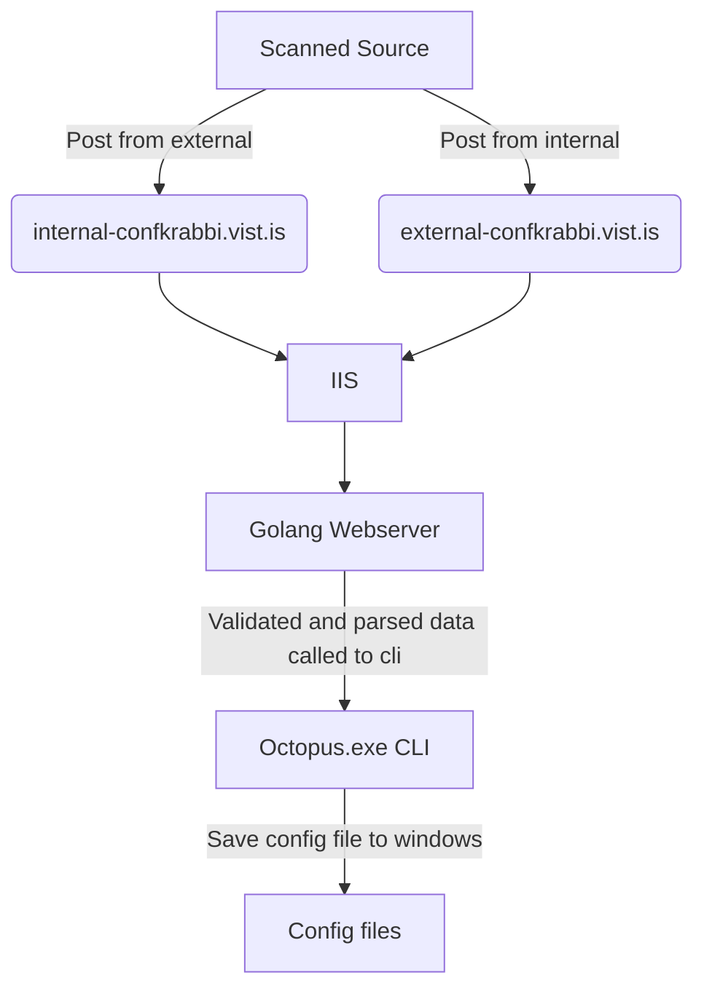

# Octopus-ConfigPostRequestReciever
This program is a web server that receives configuration info for Octopus Scanner Configs

```mermaid
flowchart TD
    A[Scanned Source] -->|Post from internal| B(external-confkrabbi.vist.is)
    A -->|Post from external| C(internal-confkrabbi.vist.is)
    C --> D[IIS]
    B --> D
    D --> G[Golang Webserver]
    G -->|Validated and parsed data called to cli| AA[Octopus.exe CLI] 
    AA -->|Save config file to windows| AB[Config files] 
```
